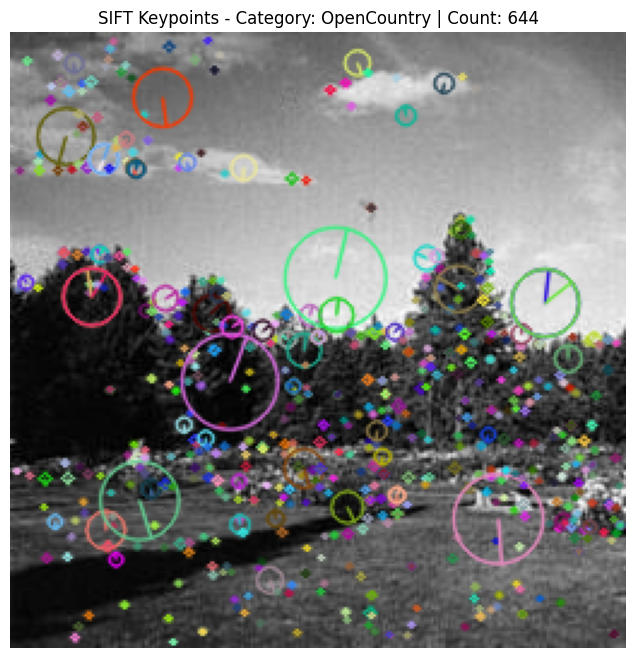
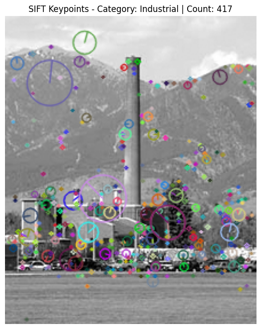
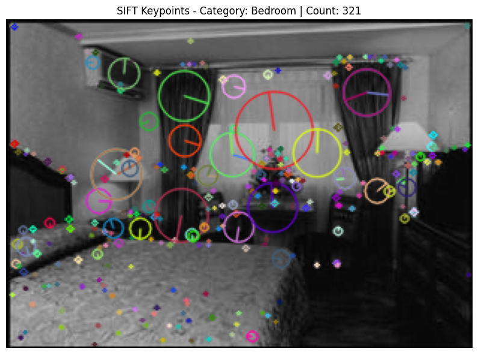
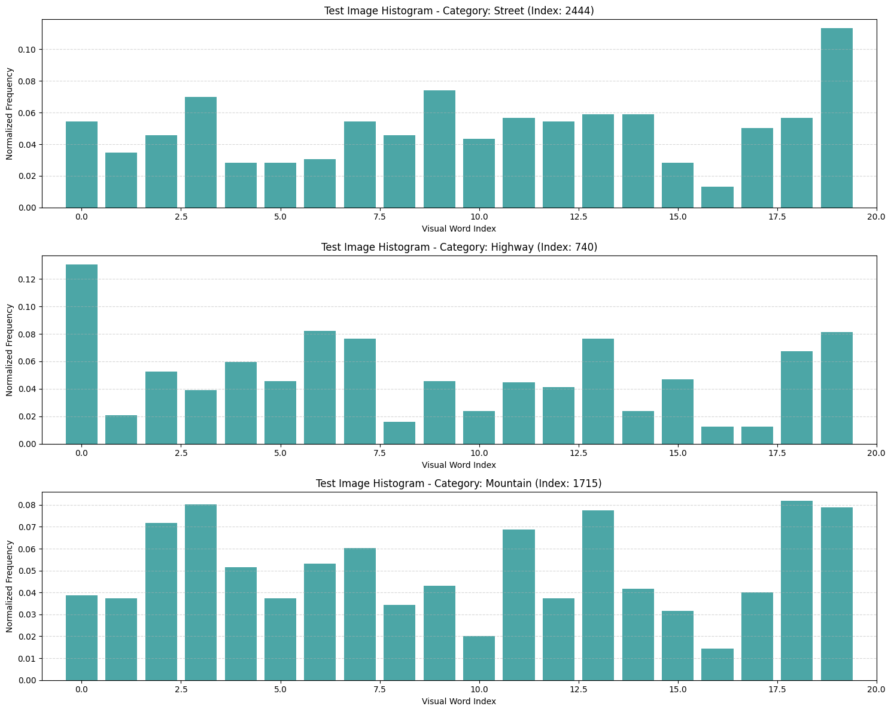
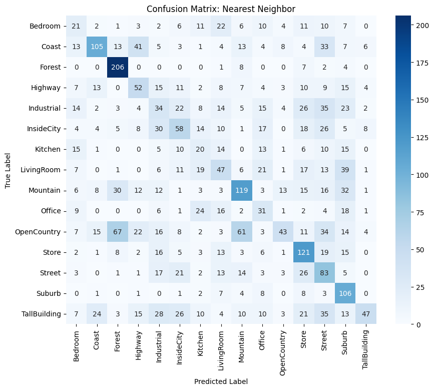
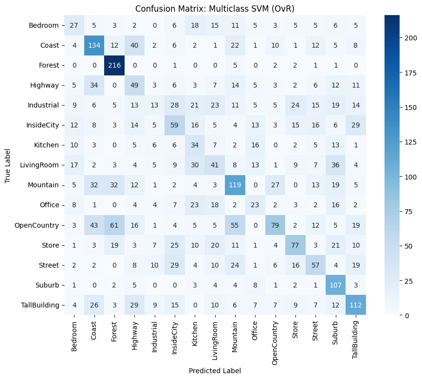
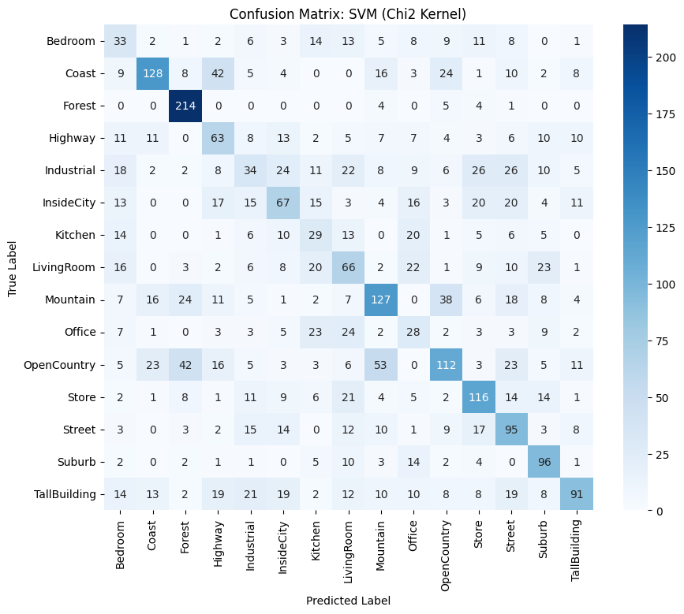

# CVPR Report on Project 2 - Bag-of-Words classifier

## Motivation
I selected this project because it aligns closely with my academic interests and has strong potential for reuse in a future Electronic System Design course. In that course, I plan to develop a system that acquires image data from a camera through an FPGA platform (DE10-SoC) and performs image processing tasks, with the goal of recognizing vehicle license plate numbers. This project provides a solid foundation for that objective, as it allows me to explore relevant concepts and techniques that can be extended and adapted for more advanced image acquisition and processing applications.

## Introduction
In this project, a complete Bag-of-Words image classification pipeline is implemented and evaluated on a scene recognition dataset containing 15 classes. The pipeline includes visual vocabulary construction using k-means clustering, histogram-based image representation, and classification using both nearest-neighbour and multiclass linear Support Vector Machine classifiers. The performance of the proposed approach is assessed using confusion matrices and overall classification accuracy.

## Tools
The chosen development environment for this project is Google Colab Notebook, as it offers a straightforward setup, minimal configuration requirements, and provides all the necessary computational tools. To organise the project, a dedicated folder was created in Google Drive, containing the provided training and test datasets obtained from Moodle. A Google Colab notebook was then used to access this directory and process the image data stored within it.


## 1. Building a Visual Vocabulary
To complete this task it was required to sample a certain number of sift descriptors, cluster them and save the centroids for future use. This was done similarly to the approach presented in class in the LabLecture2. The requirement stated that we would need a variable number of samples and cluster numbers, and this was implemented seemlesly in the code. 

Since we are dealing with very different scenes in the dataset a MAX_PER_IMAGE limit on sift descriptors was used to try and avoid overrepresentation since some images might contain a very large number of descriptors like an image of a forest which might yield thousands of SIFT descriptors, while a simple image of a clear sky or a plain wall might only yield a few dozen.

<p align="center">
  
  
  
</p>

Collecting all descriptors for each image would let more "complex" images dominate the pool and bias KMeans toward their features. Limiting descriptors per image ensures each image contributes more equally, producing a more balanced and robust visual vocabulary.

Proceeding with the task, k-means clustering was implemented, leaving the number of clusters as a user definable value to be able to experiment and fine-tune the pipeline. Note that the n_init parameter in the KMeans function is set to 10, essentially running the algorithm 10 times with different initialisations and then choosing the best solution. The .gif shows intuitively what the algorithm does.


## 2. Representing train set images as histograms
After having constructed the visual vocabulary, we now need to represent each image of the training set as a normalised histogram having k bins, each corresponding to a visual word.

For a given image, local features are first extracted using the SIFT descriptor. Unlike the vocabulary construction stage, no explicit limit is imposed on the number of descriptors per image at this step, since the goal is to capture the full distribution of visual patterns present in each image.

Each extracted descriptor is then assigned to its closest visual word by finding the nearest cluster centroid in the previously learnt k-means model. This assignment is performed using the k-means prediction function ```words = kmeans_model.predict(descriptors)```, which returns, for each descriptor, the index of the corresponding visual word.

We then build a histogram using the ```np.histogram``` function which counts how many times each visual word (each cluster index) appears in the "words" array, defined earlier.

To make the representation invariant to the number of detected keypoints and comparable across images, the histogram is normalised using L1 normalisation, meaning that the sum of all bin values equals one. This step is essential since it prevents images with many detected features from dominating distance based classification methods, like the ones we will use in a later stage.

This procedure is then repeated for all images in the training set, producing a matrix of size ```N × k```, where N is the number of training images and k is the vocabulary size. Each row of this matrix represents the BoW histogram of one image and serves as input to the subsequent classification stages.




## 3. Nearest Neighbour Classifier

The first classifier we are required to implement is the nearest neighbour classifier. The goal is to assess how well the histogram representation discriminates between the 15 scene categories using this simple classification approach.

Firstly, each image in the test set is processed using the same Bag-of-Words pipeline adopted for the training images in steps 1 and 2. Then A Nearest Neighbor classifier is implemented, with ```n_neighbors=1```, to assign a label to each test image. Note that modifying the ```n_neighbors=K``` K parameter value to a higher number could provide better results since the classifier looks at the ```K``` closest training samples and assigns the test sample the class that is most common among those ```K``` neighbours (a majority vote). 

For simplicity the distance employed at this stage is the Euclidean distance, which may not be the best choice but is a reasonable starting point since we will later use more sophisticated classifiers and also explore the chi-squared distance. Note that other distance options for finding the "closest" neighbours, like cosine distance or Manhattan distance, could be used.

Unlike parametric models, the Nearest Neighbor classifier does not require an explicit training phase; it simply stores the feature vectors and corresponding labels of the training images.

After setting up and implementing the k-NN classfier it is evaluated by comparing the predicted label of each test image with the ground truth (the actual label of the image). this is done in the following line of code: ```accuracy = accuracy_score(y_test, y_pred_nn)```, where ```y_test``` represents the true labels of the test dataset (like "Coast", "Forest" ...) and ```y_pred_nn``` represents the predicted labels generated by the NN classifier for the same test dataset.

The final accuracy value is printed on stdout in percentage by simply multiplying ```accuracy``` by ```100```.

As for the results, this classifier performs decently well with an accuracy of roughly 30% with euclidean distance and ```n_neihbors=1```. Changing to manhattan distance increases the accuracy to 35%; however changing ```n_neihbors``` value to 15 and keeping the euclidean distance seems to be the sweetspot pushing the accuracy to rougly 37%. 

In addition to accuracy, a confusion matrix is computed to provide a detailed analysis of performance. The confusion matrix reports, for each true category, the number of test images assigned to each predicted category. This allows easy identification of frequently confused classes, like visually similar indoor or outdoor environments. In this implementation, the confusion matrix is visualized using a heatmap representation, making inspection of the classifier’s strengths and weaknesses across the 15 categories easy to spot.



The most frequently confused classes are Forest and Open Country, as well as Open Country and Mountains. This is expected, since images labeled as Open Country in the dataset often contain visual elements of forests or mountainous terrain. As a result, these overlapping features naturally confuse the relatively simple classification model.

<p align="center">
  
  
  
</p>

Lastly, the Nearest Neighbour classifier provided a simple and effective baseline for evaluating the Bag-of-Words representation. While it did not model class boundaries explicitly, its performance reflected the quality of the visual vocabulary and the histogram representation. 

The results obtained with this method will serve as a reference point for comparison with more advanced classifiers, such as the linear Support Vector Machine presented in the following section.


## 4. Training a multiclass linear SVM
Since standard SVMs are inherently binary classifiers, and we have 15 classes, we will train a multiclass linear Support Vector Machine (SVM) classifier using the one-vs-rest strategy, with the goal of learning decision boundaries for each of the 15 scene categories present in our dataset. 

Before training the SVM classifiers, the BoW histograms are scaled ensuring that all features are on a comparable scale. A ```StandardScaler``` is fitted on the training data and then applied to both the training and test histograms. This results in features with zero mean and unit variance, which helps the linear SVM treat all features equally during learning.

```py
scaler = StandardScaler()
X_train_scaled = scaler.fit_transform(X_train)
X_test_scaled = scaler.transform(X_test)
```

The scaler is fitted only on the training data to avoid using any information from the test set, while the same transformation is applied to the test data to ensure consistency between training and evaluation.

To handle the 15-category classification problem, a one-vs-rest strategy is used. Meaning a separate binary classifier is trained for each of the 15 categories: samples belonging to the target class are labeled as positive (1), while all other samples are labeled as negative (0).

A total of 15 linear SVM classifiers are trained, one for each scene category. Each classifier learns a linear decision boundary that separates its class from the rest. The LinearSVC implementation from scikit-learn is used with a regularisation parameter ```𝐶=1.0```, which balances the trade-off between maximising the margin and minimising classification errors.

Note that a lower C creates a wider margin, allowing more misclassifications but potentially leading to a more generalized model while a higher valued C creates a narrower margin, penalizing misclassifications more heavily. This results in a model that fits the training data more closely but might be prone to overfitting.

The trained classifiers will be later combined during evaluation to produce multiclass predictions.

Note that:
- The SVM training process is made deterministic using a fixed random seed
- A sufficiently large maximum number of iterations ensures that the optimization algorithm has time to converge
- The dual formulation is disabled to improve efficiency, as the number of training samples exceeds the feature dimensionality.

Compared to the Nearest Neighbor approach, the linear SVM classifier provides a more powerful alternative by explicitly learning class-specific boundaries in the feature space. While still relatively simple, this model should outperform the Nearest Neighbor baseline since it better captures the discriminative patterns across scene categories. The effectiveness of this approach is evaluated in the following section.


## 5. Evaluating the multiclass SVM
The performance of the SVM is evaluated on the test set. Each test image is represented using a normalised Bag-of-Words histogram stored in ```X_test_scaled```. This guarantees consistency between training and test representations and prevents feature scaling discrepancies from affecting the performance of our classification.

We then provide the histogram of each test image as an input to every binary SVM classifier. Each of these classifiers then computes a real-valued output via its decision function, corresponding to the signed distance between the test sample and the separating hyperplane. These scores quantify the confidence of each classifier with respect to its target class. 
As a result, each test image is associated with a vector of 15 real-valued scores, one for each scene category.
The predicted class is therefore the index of the classifier whose decision function yields the highest score. This procedure is repeated for all test images, resulting in a predicted label for each sample in the test set.

```py
# Calculate Accuracy
svm_acc = accuracy_score(y_test, y_pred_svm)
print(f"Multiclass SVM Accuracy: {svm_acc*100:.2f}%")
```

The predicted class labels are compared with the ground truth (```y_test```), to compute the overall classification accuracy. This accuracy measures how often the classifier makes correct predictions across all classes and allows a direct comparison with the Nearest Neighbour baseline.
In addition to accuracy, a confusion matrix is computed and visualised to analyse class-wise performance. This highlights common confusions between visually similar scene classes and provides insights into the strengths and weaknesses of the multiclass SVM classifier.



As we can see form the results, the multiclass linear SVM demonstrates slightly improved performance compared to the Nearest Neighbor classifier. Pushing our acuracy to roughly 39%.


## Optional tasks

### 6. Training the SVM using a Gaussian kernel
This section explores an optional extension of the project, in which a non-linear Support Vector Machine is trained using a generalized Gaussian kernel based on the χ² distance. This kernel is particularly well suited for histogram representations, such as our Bag-of-Words features, as it better captures differences of distribution between feature vectors.

We start by computing our kernels using the ```chi2_kernel(X_train, X_train, gamma=0.5)``` function provided by the sickit learn library. This function implements a generalised Gaussian kernel based on the  χ² distance, where gamma is a scaling parameter.

A multiclass SVM classifier is trained using the precomputed χ² kernel matrix. The standard SVC implementation is employed with the kernel='precomputed' option, allowing for direct use of the custom kernel we calculated. Note that a higher regularisation parameter ```C``` is selected compared to the one used in the linear SVM, as we now have a non-linear kernel with more complex decision boundaries which often benefit from reduced regularisation.

The trained SVM is evaluated on the test set by predicting class labels using the χ² kernel computed between test and training histograms. The classification accuracy is computed once again by comparing the predicted labels with the ground truth annotations and we also construct a confusion matrix to analyze performance more closely. 



The performance of this classifier jumps to roughly 44% compared to the linear SVM which had an accuracy of roughly 39%.


### 7. Multiclass SVM using the Error Correcting Output Code (ECOC)
This task was performed following the approach introduced by Dietterich and Bakiri (1994). Here each class is represented by a binary code (an array of 0 and 1). Ideally we want each class represented by a unique code. 
The implementation was done using the scikit-learn library's OutputCodeClassifier function, which generates these unique codes randomly. 
So instead of training one classifier per class (as in one-vs-rest), ECOC uses one binary classifier per bit of the unique code for each class (codebook). 
Since we have more classifiers than in our previous approaches, some of them should theoretically correct the mistakes made by other classifiers. However in practice classifier mistakes are correlated and this does not happen. 
This is exactly what we see in our results: the accuracy of this approach is roughly 32%.


### 8. Soft assigment
In the standard BoW model used so far, each SIFT descriptor is assigned to a single visual word (cluster centroid) using hard assignment. However, this can lead to quantisation errors, especially when descriptors are near cluster boundaries.

Soft assignment addresses this issue by allowing each descriptor to contribute to multiple histogram bins with corresponding weights based on distance to each cluster centre. This provides a smoother, more robust image representation

This is exactly what was implemented in step 8. 1000 SIFT descriptors were randomly sampled from the training set. For each descriptor, the distance to all cluster centers was computed, and the minimum distances were recorded. The average of these minimum distances was then used as the value of σ, which controls the Gaussian soft assignment, assigning higher weights to clusters closer to each descriptor.
```py
weights = np.exp(- (distances ** 2) / (2  sigma * 2))
```
A function that computes the soft assignment histogram for a given image was then built. For each image, SIFT descriptors are extracted, and for each descriptor, the distances to all cluster centers are calculated to determine the corresponding weights. The contributions of all descriptors are then summed to construct the histogram, which is then L1 normalised to ensure comparability across images.
Both the train and test datasets were processed using this function, producing ```X_train_soft``` and ```X_test_soft```; which contain the histograms.

As stated earlier the linear multiclass SVM achieved an accuracy of 38%, whereas the current approach improved performance to 46%!


### 9. Adding spatial information
While Bag-of-Words (BoW) histograms capture the appearance of local features, they ignore spatial information, which can be important for distinguishing image categories.

Spatial Pyramid Matching (SPM) [Lazebnik et al., 2006] addresses this by partitioning the image into grids at multiple levels and computing histograms for each region. When combined with soft assignment, this approach produces feature vectors that encode both:

- Appearance information (via soft ssigned histograms)
- Spatial layout information (via pyramid subdivision)

This approach was implemented by creating a function: 
```py
def extract_spatial_pyramid_soft(img, sift_provider, kmeans_model, k, sigma)
```
which extracts the SIFT descriptors and computes the soft assignment weights and then defines two spatial pyramid levels:

- Level 0: The entire image -> 1 histogram
- Level 1: Split the image in a 2x2 grid --> 4 histograms

To create the 4 histograms (one for each block of the 2x2 grid), the ```x``` and ```y``` coordinates of each keypoint were used, allowing us to determine which quadrant it belongs to. So at the end we have a feature vector that is 5 times bigger after concatenation. Lastly, L1 normalisation was performed to ensure comparability between images. 
The train and test images were then processed using this function in order to produce ```X_train_spm``` and ```X_test_spm```. Histograms are then standardised using ```StandardScaler``` before training a Linear SVM. 

This approach increases accuracy to 47% from the initial 36% baseline. 
Note that it is only roughly 1% more accurate than the soft assigment method. This may be due to small object sizes, variable spatial arrangements, or reduced descriptor density in subdivided quadrants. Nonetheless, the spatial pyramid representation maintains performance while encoding additional spatial structure. 


## Disclaimer ⚠️
The code used in this project was largely written with the assistance of a large language model, due to my limited proficiency in programming languages. However, I am able to read, understand, and critically evaluate the implemented code. Thus, all design choices, results, and any potential errors or inaccuracies present in this project are solely my responsibility.


## References
- Class Slides [available on moodle]
- https://en.wikipedia.org/wiki/K-means_clustering
- Lab Lecture Laboratories [Espetially LabLecture2]
- https://scikit-learn.org/stable/supervised_learning.html
- https://scikit-learn.org/stable/modules/generated/sklearn.multiclass.OutputCodeClassifier.html
- https://scikit-learn.org/stable/modules/generated/sklearn.metrics.pairwise.chi2_kernel.html
- https://scikit-learn.org/stable/modules/generated/sklearn.svm.SVC.html
- [Dietterich and Bakiri, 1994] Dietterich, T. G. and Bakiri, G. (1994). Solving
multiclass learning problems via error-correcting output codes. Journal of
artificial intelligence research, 2:263–286.
- [Lazebnik et al., 2006] Lazebnik, S., Schmid, C., and Ponce, J. (2006). Beyond
bags of features: Spatial pyramid matching for recognizing natural scene
categories. In 2006 IEEE Computer Society Conference on Computer Vision
and Pattern Recognition (CVPR’06), volume 2, pages 2169–2178.


